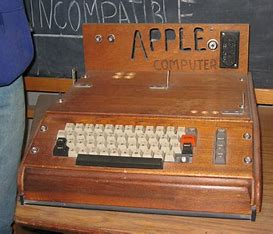
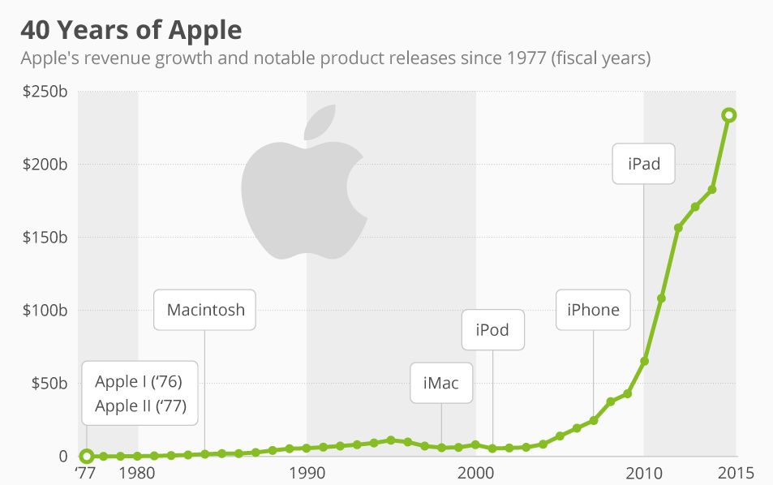
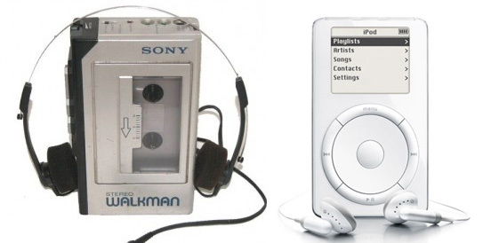

# Ambidextrous Organization
  
## YANRUI-HAO 
## 22/11/2023
   
---
## unitary organization

Apple

  
---
 

---
## Ambidextrous Organization
 

---
## Adaptive functions / Innovative functions
Cost and profit orientation /Focus on innovation

Minimize risk / Risk transferred    

Progressive innovation / Radical innovation

---

---
*THE END*